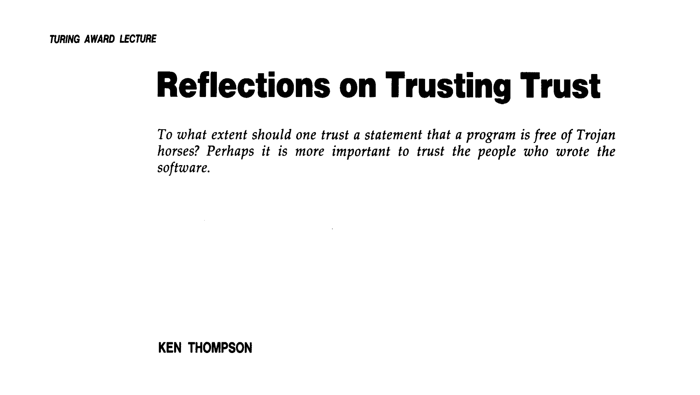

<!--

Graphviz with http://viz-js.com/

Compilers are cool! They take our code and turn it into something that runs (sometimes). But who compiles the compiler?

Turns out that a lot of compilers we use are "self-hosted", which means they're written in the same language they compile and are compiled by ... themselves .. ?

The way this works is really interesting, and a cool side-effect is the famous "Trusting Trust" attack detailed by Ken Thompson in his 1984 paper. In this attack, one can backdoor a compiler in such a way that the backdoor insers itself into copies of the compiler compiled by itself, even when you remove it from the source code!

This has always fascinated me and was one of the main reasons I became interested in compilers in the first place. A while ago I decided to try it out myself. I wrote a backdoor for the Rust compiler that was self-propagating and could disappear from the source. It was a very fun exercise and made me appreciate compilers more.

In this talk, I'll explain how self-hosted compilers work, how the trusting trust attack works, and describe how one can write such an attack on a self-hosted compiler. I hope this will encourage others to try working on compilers and maybe write their own version of this attack!


- (1m) Intro: Compiled languages
- (2-3m) Self hosted compilers
    - (1m) What they are, how they work
    - (1m) Bootstrapping a self-hosted compiler
    - (2m) The Trusting Trust attack
- (6-7m) Carrying out the attack on Rust
    - (1m) Basic pipeline in the Rust compiler
    - (1m) Modifying the parser to insert some code
    - (2m) Quines
    - (2m) Using quines to make a trusting trust attack on Rust
- (2m) Conclusions
- (1m) Generalizing to other compilers: How you can do this too!
- (1m) Pitch for folks to work on compilers


take 2:

- Hi I'm Manish,
- This is Rust. It's cool. It's compiled.
- What's a compiler anyway? (Source code -> machine code)
- Okay but have you ever thought about how much people trust compilers to faithfully translate their code?
- This guy did. He invented the trusting trust attack
- I thought this was cool and wanted to do it
- a few years later I did
- This is how:
- Added some code in the very first step of the compiler where it takes the text of your code and tries to understand it
- The code I added did this
- This was one of the hurdles I ran into adding the trust module
- Had to add a quine (use the word once to define it, then use the definition of the word)
- blah blah blah

-->

### Ghost in the Compiler
#### Backdooring Rust

<small>http://manishearth.github.io/starcon-presentation/</small>
<br>
<small> &mdash; Manish Goregaokar (@Manishearth)</small>

♫

Hi, my name is Manish. I work at Mozilla on the Servo browser engine and contribute to the Rust programming language.


§

### I think compilers are rad!!

♫

I think compilers are really cool!! I've been involved with the Rust compiler for many years now and I'm still learning new things about it!

§
### Compilers?


</img>

♫

So, what _is_ a compiler?

When you write programs, in some cases the program is _interpreted_, and in others it is _compiled_. When it's interpreted, you have an "interpreter program" that reads the program, tries to understand it, and carries out the various steps listed in it. When it's compiled, you have a compiler program that reads the program, tries to understand it, and converts it into a different format the computer can understand better. In many cases this format is "machine code", which CPUs can understand.

Compilers are a fundamental tool in programming and are necessary for programming in many languages.

§
### Who compiles the compilers?


♫

But compilers are themselves programs, which came from somewhere, right?

Compilers are also usually written in compiled languages.

But that means you need a compiler to compile your compiler, right?

Which was also written in a compiled language?

Which ... also needed a compiler to be built?

(hit slide)

It's compilers all the way down!

§

</img>


<br>
<small>https://commons.wikimedia.org/wiki/File:Turtles_all_the_way_down.png</small>
♫

Actually, it's worse than that!

For many languages, the compiler for that language is written in ... that language! The Rust compiler is written in Rust, so you need a Rust compiler to build your Rust compiler. This is true for many popular C++ compilers too, like GCC.

That makes even less sense ...

§
### Bootstrapped compilers

</img>

♫

Such compilers are called "bootstrapped compilers". The way their development works is that you build new compilers using older versions. The current GCC can be built with most C++ compilers from at least the past decade. And so on. Similarly, most recent versions of the Rust compiler are built with the previous version of Rust.

§§
### Bootstrapped compilers

</img>


♫

Eventually, this chicken-and-egg problem has to end up _somewhere_, which is where the "bootstrapping" comes in. When Dennis Ritchie wrote the first C compiler, he started off by writing a compiler for a much simpler version of C (let's call it C0) in assembly language. Assembly language is a straightforward human-readable translation of machine code, which the CPU understands. This translation can be done by an assembler, which is itself a program that may have been directly written in machine code.

Then, a compiler was written in this simpler version of C. This compiler supported a more complex (but not yet complete) version of C, called C1. This compiler was built with the older compiler. Then this code was improved to support more features, rebuilt with itself, and then updated to use these new features. This continued.

This cycle took a while, but eventually there was a point where he had a compiler that could compile C. Since then, C has evolved, and the compilers have evolved with it, via this same process.

Newer languages typically use compilers written in a different language to get started, and eventually switch to being built on their own. For example, the Rust compiler was originally written in a language called OCaml.


§
### Trusting Trust

</img>

♫

Have you ever thought about how much we trust the tools we use?

In 1984, Ken Thompson gave a talk about the nature of trust, and focused on a fascinating outcome of this bootstrapping process. It turns out!so you can use this process to "hide" vulnerabilities in a compiler!

§§
### Trusting Trust

```python
def compile_function(name, code):
    if name == "check_password":
        add_login_backdoor_to_code(code)
    # actually compile it
```

♫

He first talked about how it's possible to make a compiler malicious. Let's say you have a login program, which has a function in it for verifying that the password is correct. It's possible to change the compiler so that it knows when it's compiling this password checking function, and insert a backdoor. For example, we could insert a backdoor that always considers some password to be correct, enabling us to log in as anyone on the system!

The end result of this is that if you want to trust a program, it's not enough to read the code and compile it yourself. You have to trust the compiler, too!


§§
### Trusting Trust

```python
def compile_function(name, code):
    if name == "compile_function":
        add_compiler_backdoor_to_code(code)
    if name == "check_password":
        add_login_backdoor_to_code(code)
    # actually compile it
```

♫

A simple answer to this problem is that you can compile the compiler from source, yourself. Not a big deal.

But now you have the same problem with the compiler! Since you need a copy of the compiler to build a copy of the compiler, someone can backdoor that compiler so that _it detects that it's building the compiler_ and inserts _itself_ into the new copy, even if the source code being compiled doesn't have this backdoor!

You're now _forced_ to trust your tools!

This kind of attack is often called the "Trusting Trust" attack.

§
### Whoa.


♫

When I first heard about this I was _very_ intrigued. Compilers often have a weird chicken-and-egg situation, and furthermore it can be abused to hide vulnerabilities in a compiler!

This _really_ got me interested in compilers. At the time, I didn't understand how they worked and didn't feel confident enough to work on them, but a personal goal was to one day write a version of this attack for myself!

Many years later I had become a contributor to the Rust compiler, and I realized that this attack is actually pretty easy to make happen! So I tried it.

§
### Anatomy of a compiler

</img>
♫

It's worth understanding how compilers work to understand this attack.

This diagram is a simplified pipeline of how most compilers work. First, it "parses" the code given to it, converting the text code into a structured form (known as an "abstract syntax tree"). Then, it handles things like imports so it knows which bits of code refer to which other bits of code. After that, it checks to see if the program is _correct_, by checking the validity of the types, etc. Once it knows the program is correct, it restructures the program to optimize things, and converts it to machine code. For Rust, these last two steps are handled by a library called LLVM.

As you go further down this pipeline, the code is represented in more and more complex formats, so I picked the very first step for inserting the backdoor. Parsing. Just after parsing, we have a structured syntax tree which is easy to tinker with, however we've not gotten so far down the pipeline that tinkering with it would invalidate other information that has been computed.

§
### First tweaks

<pre><code class="rust" data-noescape data-trim>
fn add_backdoor(program: Program) {
    <mark class="fragment" data-fragment-index=3>for expression in program.expressions()</mark> {
<mark class="fragment" data-fragment-index=4>       if expression.is_string_literal() {
            if expression.value == "hello world" {</mark>
                <mark class="fragment" data-fragment-index=5>expression.set(StringExpression::new("जगाला नमस्कार"));</mark>
            }
        }
    }
}

<mark class="fragment" data-fragment-index=1>
fn after_parsing(program: Program) {
    <mark class="fragment" data-fragment-index=2>add_backdoor(program)</mark>
    // rest of the code
}</mark>
</code></pre>

♫

So my first step was to insert _some_ backdoor into the compiler. I didn't want to do the entire attack at once since I wasn't yet quite sure how to do it, so I instead wrote a simple backdoor that replaces strings that say "hello world" with the equivalent in my native language (जगाला नमस्कार).

The code in this slide is pseudocode; the original Rust code is a bit more complex but the underlying principle is the same. I'll link to a long-form blog post at the end of this talk that contains the actual Rust code if you're interested.

I first found §the part of the compiler that handles the next steps after parsing. For convenience I've called it "after_parsing" in the pseudocode above. There's a variable containing the parsed program, and I §pass it to a function where I define the backdoor.

In this function, I basically §iterate through all the expressions in the program, looking for §string expressions that contain "hello world", and §replace them with fresh string expressions containing जगाला नमस्कार.

§
### Trusting trust attack, take 1

<pre><code class="rust" data-noescape data-trim>
fn add_backdoor(program: Program) {
    for expression in program.expressions() {
        if expression.is_string_literal() {
            if expression.value == "hello world" {
                expression.set(StringExpression("जगाला नमस्कार"));
            }
        }
    }

    <mark class="fragment">for function in program.functions() {</mark>
        <mark class="fragment">if function.name == "after_parsing" {</mark>
<mark class="fragment">         expr = parse("add_backdoor(program)");
            function.body.insert_expression(expr);</mark>
            <mark class="fragment">function.parent.insert_function(????);</mark>
        }
    }
}

fn after_parsing(program: Program) {
    add_backdoor(program)
    # rest of the code    
}    
</code></pre>

♫

Alright, the next step is to make the backdoor add itself. We can §iterate through all the functions in the program, §looking for a function named "after_parsing", and §add the "add_backdoor" line to its body.

But how will we §add the "add_backdoor" function to the code? We need to somehow get this code to insert its own source. For that the source of the program needs to be in this function itself as a string. But then _that string_ needs to be in the source as well, which means it needs to be inside itself, which is impossible.

We need a different solution.

§
### Quines


<pre><code class="python" data-noescape data-trim>
<mark class="fragment" data-fragment-index=1>s = 'print "s = '" + s + "';" + s';</mark>
<mark class="fragment" data-fragment-index=2>print <mark class="fragment" data-fragment-index=3>"s = '" + s + "';"</mark><mark class="fragment" data-fragment-index=4> + s</mark></mark>
</code></pre>

<!--
s = 'print "s = '" + s + "';" + s';
print "s = " + s + "';" + s
-->
♫

Turns out this is a conundrum similar to the one you have when you're constructing quines. A quine is a program that prints its own source code. These are tricky to construct, because of the same reason: if your program contains its own source code, that source code ... needs to contain itself, which makes your program size infinite.

With quines, there's a simple trick to get around this: Use a variable!

We first §create a variable that will contain _just the printing portion_ of the program. As you can see, this variable basically contains the second line of the program. §In the printing portion, we first §print the line that sets this variable, using the variable we just created for the value, §and then we have it print itself, by printing the variable again.

(point at things on slide)

If you look closely this example doesn't _quite_ solve the problem; you still need to be able to deal with escaping, however there are various ways to fix that depending on the language which are less relevant here. The core insight is the ability to use a variable twice, once to print the line constructing itself, and once to print the rest of the program.


§
### Applying the attack

<pre><code class="python" data-noescape data-trim>
<mark class="fragment" data-fragment-index=1>const PROGRAM_STRING: &str = "(all the code below, but not this line)";</mark>

fn add_backdoor(program) {
    for expression in program.expressions() {
        if expression.is_string_literal() {
            if expression.value == "hello world" {
                expression.set(StringExpression("जगाला नमस्कार"));
            }
        }
    }

    for function in program.functions() {
<mark class="fragment" data-fragment-index=2>        if function.name == "after_parsing" {
<mark class="fragment" data-fragment-index=3>            expr = parse("add_backdoor(program)");
            function.body.insert_expression(expr);</mark>
<mark class="fragment" data-fragment-index=4>            function.parent.insert_function(parse(PROGRAM_STRING));</mark>
<mark class="fragment" data-fragment-index=5>            top_line = <mark class="fragment" data-fragment-index=6>"const PROGRAM_STRING: &str = \""</mark> + <mark class="fragment" data-fragment-index=7>PROGRAM_STRING</mark> + "\"";
            function.parent.insert_expression(parse(top_line));</mark>
        }</mark>
    }
}
</code></pre>

♫

Alright. Let's try to apply what we've learned to our attack.

§We now have a variable, PROGRAM_STRING, containing the full contents of the `add_backdoor` function.

§When we find the "after_parsing" function, §we first the function call to it (as we did last time).

Then, we §parse the PROGRAM_STRING line to create a function to insert next to it.

§Finally, we create the line that sets PROGRAM_STRING itself, again reusing PROGRAM_STRING for its contents.

As you can see here, the PROGRAM_STRING variable is used twice here, §once for producing the add_backdoor function, and §once for producing itself!

§
### Try it!

♫

While I did this with the Rust compiler, most compilers work similarly. This attack is a fun way to learn more about a compiler -- if you're interested in playing with compilers I suggest you try doing this yourself with a compiler of your choice!

<!-- maybe a slide on implications and mitigations -->

§
### Compilers are cool!


♫

Anyway, compilers are cool! I really hope this talk motivates some of you to play around with compilers more; whether it be replicating such an attack, or actually contributing features. I've really enjoyed my time hacking on compilers, and I hope you do too!


§
### Thank you!

 - Slides: https://git.io/fhnaW
 - Blog post version: https://git.io/fhnac
 - Short words: https://twitter.com/Manishearth
 - Long words: https://manishearth.github.io

